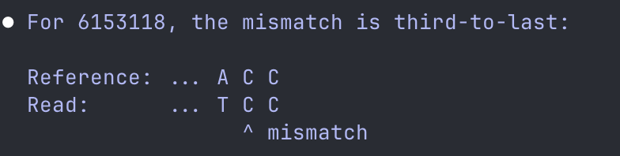
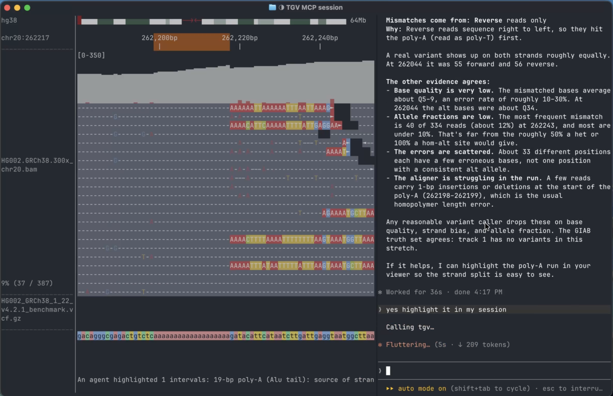

# tgv: Genome viewer for you and your agents


https://github.com/user-attachments/assets/8b630f0e-6bcc-4aff-88f3-9e2465550f32


### Explore genomes everywhere.

tgv (Terminal Genome Viewer) is blazing-fast. Your SSH session is no longer a black box.
- Navigate genomes with vim-style commands (but the mouse works too).
- Rich file format support: BAM, VCF, BCF, BED, bigBed; object storage (s3); and any UCSC reference genome.
- tgv GUI coming soon.

### Designed for human-agent collaboration.

<table>
  <tr>
    <td width="50%" valign="top"></td>
    <td width="50%" valign="top"></td>
  </tr>
  <tr>
    <td width="50%" valign="top">Before tgv: agents draw questionable ASCII art.</td>
    <td width="50%" valign="top">After tgv: agents explain the analysis in an interactive session.</td>
  </tr>
</table>

### Mise-en-place so that your agents can cook.

tgv organizes messy omics data to a [performant data engine](https://pola.rs/posts/release-polars-2/) that's fully exposed to agents through MCP. A multi-omics analysis takes a few lines of SQL queries. 
- No more glue scripts chaining `samtools`, `bcftools`, and `awk`. 
- No more off-by-one bugs from mixing 0-based and 1-based tools. 
- No more wasted tokens.

## [**Installation**](doc/src/installation.md)

[](https://crates.io/crates/tgv) [](https://anaconda.org/bioconda/tgv)

> [!NOTE]
> tgv is in early development. Please report bugs and we will fix them asap.

- cargo: `cargo install tgv --locked`
- brew: `brew tap zeqianli/tgv && brew install tgv`
- bioconda: `conda install bioconda::tgv`
- Pre-built binaries: [GitHub Releases](https://github.com/zeqianli/tgv/releases/)

Install tgv MCP: 
- Codex: `codex mcp add tgv -- tgv mcp`
- Claude: `claude mcp add tgv -- tgv mcp`
- Others: ask your agent

## TUI quick start

```bash
# Browse the hg38 human genome (internet needed)
tgv
```

- `:q`: Quit
- `h/j/k/l`: Left / down / up / right. `H/J/K/L` for faster navigation
- `W/B/w/b`: Next gene / previous gene / next exon / previous exon
- `z/o`: Zoom in / out
- `/_gene_` / `/_chr_:_position_`: Go to a gene (e.g. `/TP53`) or a position (e.g. `/1:2345`)
- `_number_` + `_movement_`: Repeat movements (e.g. `20B`: back 20 genes)
- `:ls`: Switch chromosomes
- `:e _file_`: Open more files, or drag them into the terminal
- Mouse: click, scroll, drag and hover.

[Full bindings](doc/src/usage.md)

## Usage

If you use a reference genome frequently, downloading a local cache is highly recommended. This makes TGV much faster.

```bash
# The cache is in ~/.tgv by default.
tgv download hg38
```

Browse alignments:

```bash
# View file aligned to the hg38 human reference genome
tgv file1.sorted.bam s3://my-bucket/file2.sorted.bam variants.vcf intervals.bed

# BAM file with no reference genome
tgv non_human.bam -r 1:123 --no-reference
```

[Documentation](doc/src/SUMMARY.md)

[](https://www.star-history.com/#zeqianli/tgv&Date)
